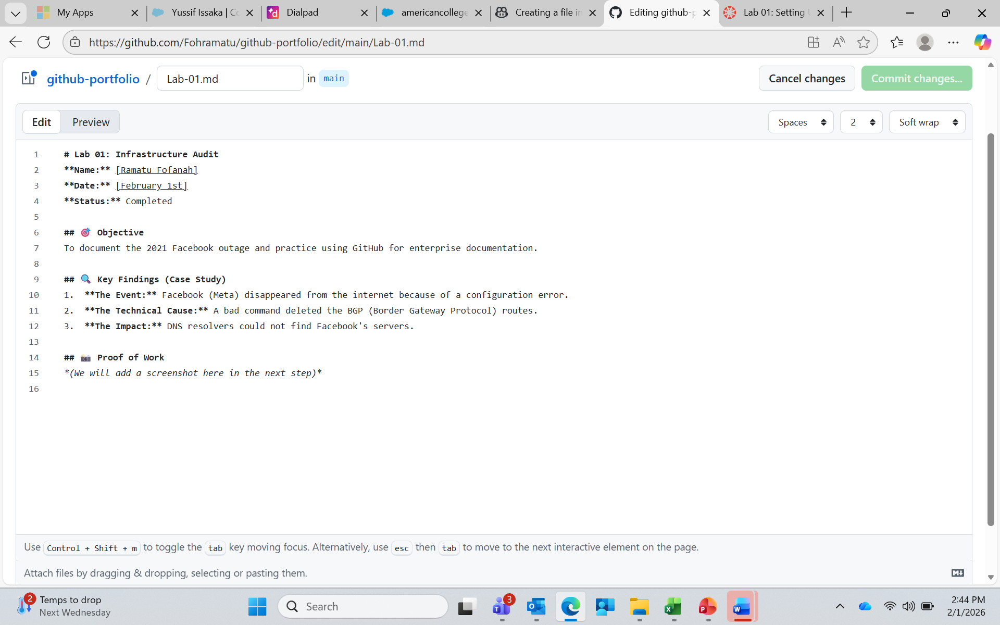

# Lab 01: Infrastructure Audit
**Name:** [Ramatu Fofanah]
**Date:** [February 1st]
**Status:** Completed

## 🎯 Objective
To document the 2021 Facebook outage and practice using GitHub for enterprise documentation.

## 🔍 Key Findings (Case Study)
1.  **The Event:** Facebook (Meta) disappeared from the internet because of a configuration error.
2.  **The Technical Cause:** A bad command deleted the BGP (Border Gateway Protocol) routes.
3.  **The Impact:** DNS resolvers could not find Facebook's servers.

## 📸 Proof of Work

